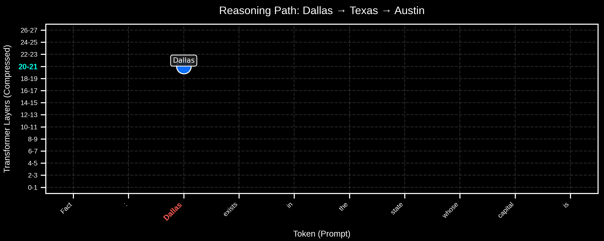
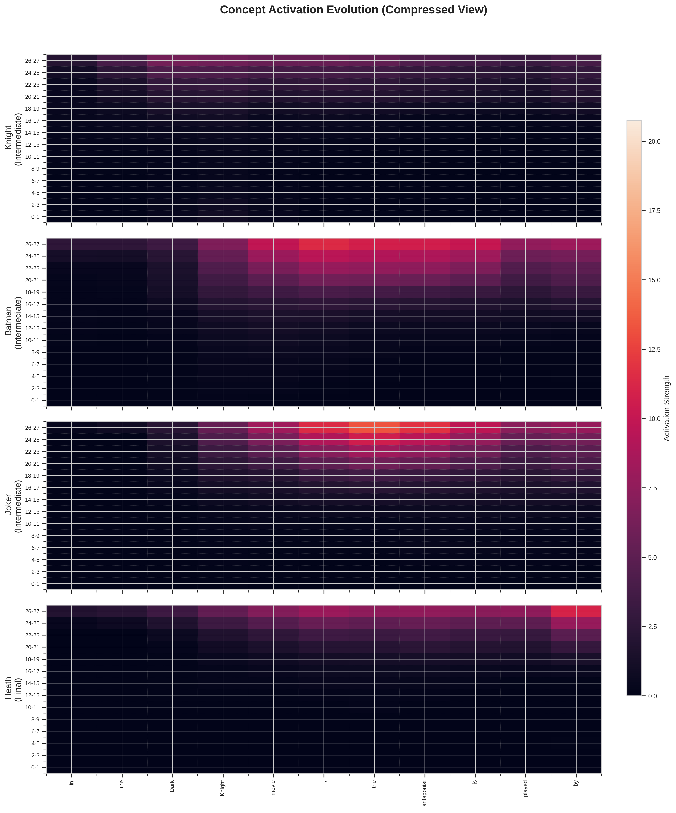
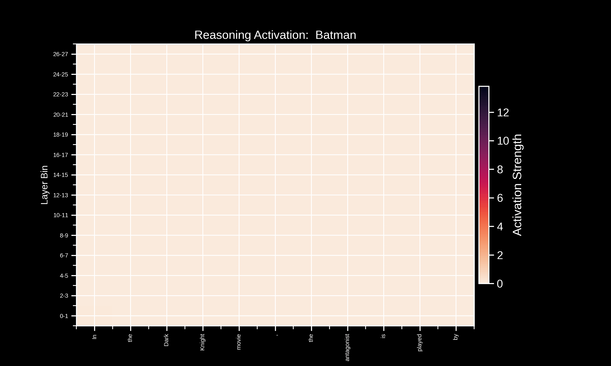
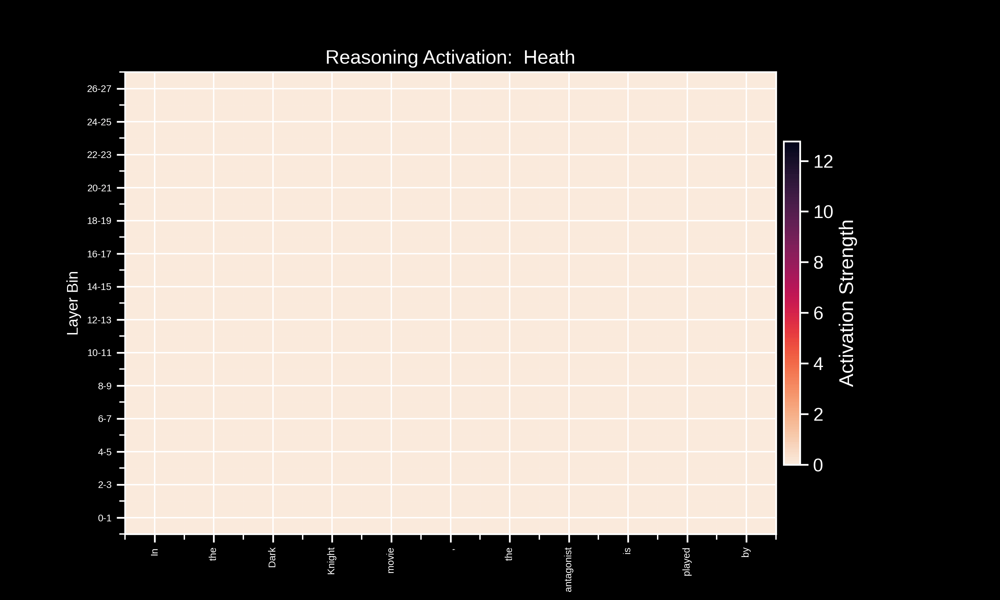
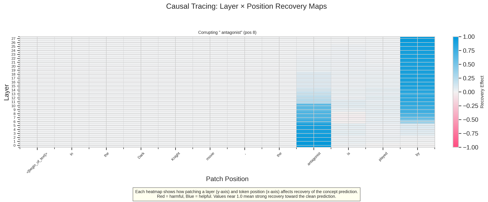
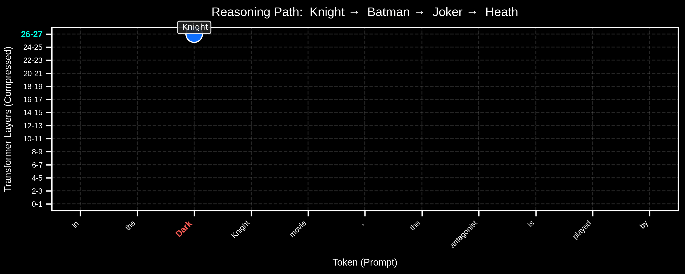
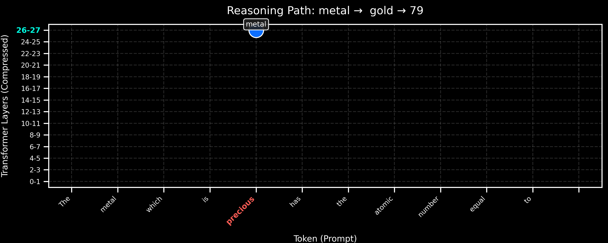
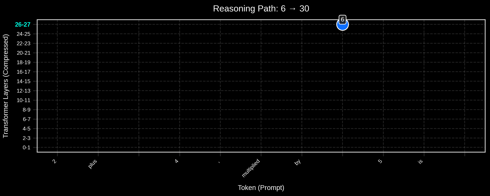

# LLM Thought Tracing: Mechanistic Interpretability for Neural Reasoning 🧠

<p align="center">
  
  <br>
  <em>Revealing the hidden reasoning process: Dallas → Texas → Austin</em>
</p>

## Table of Contents
- [Overview](#overview)
- [Key Features](#key-features)
- [Installation](#installation)
- [Showcase: Tracing Cultural Knowledge in The Dark Knight](#showcase-tracing-cultural-knowledge-in-the-dark-knight)
  - [Step 1: Concept Activation Mapping](#step-1-concept-activation-mapping)
  - [Step 2: Dynamic Concept Evolution Visualization](#step-2-dynamic-concept-evolution-visualization)
  - [Step 3: Causal Intervention](#step-3-causal-intervention)
  - [Step 4: Analyzing and visualizing the Complete Reasoning Flow](#step-4-analyzing-and-visualizing-the-complete-reasoning-flow)
- [Additional Research Examples](#additional-research-examples)
- [Technical Framework](#technical-framework)
- [Theoretical Background](#theoretical-background)
- [Citation](#citation)
- [Contributing](#contributing)
- [License](#license)
- [Acknowledgments](#acknowledgments)

## Overview

This repository draws inspiration from Anthropic's groundbreaking mechanistic interpretability work on ["Tracing the Thoughts of Language Models"](https://www.anthropic.com/news/tracing-thoughts-language-model). While LLMs appear to generate text in a single forward pass, this toolkit reveals the complex internal reasoning processes occurring across their depths.

Through rigorous activation tracing, causal interventions and dynamic visualizations, this framework exposes the inner workings of neural networks as they perform complex multi-hop reasoning, enabling insights into how these models "think".

## Key Features

🔍 **Concept Activation Tracing**: Extract and visualize when and where key concepts emerge in the model's representations  
🧩 **Multi-hop Reasoning Analysis**: Identify, score, and visualize complete reasoning paths through the model  
🧪 **Causal Interventions**: Perform targeted corruptions and patching to map information flow  
🎬 **Dynamic Visualizations**: Generate animations showing reasoning in action  
🔄 **Interpretability Pipeline**: End-to-end workflow from prompt to comprehensive reasoning analysis

## Installation

```bash
# Clone the repository
git clone https://github.com/VilohitT/llm-thought-tracing.git
cd llm-thought-tracing

# Create a virtual environment (recommended)
python -m venv myenv
source myenv/bin/activate  # On Windows: myenv\Scripts\activate

# Install dependencies
pip install -r requirements.txt
```
## Showcase: Tracing Cultural Knowledge in *The Dark Knight*

Let's demonstrate the full capabilities of this framework to systematically extract multi-hop reasoning traces from the model by prompting it on cultural knowledge. For this experiment, I use the following prompt:

> **Prompt**: "In the Dark Knight movie, the antagonist is played by"

To solve this problem, the model must:

- Recognize **"Dark Knight"** as a Batman film
- Identify the **Joker** as the antagonist
- Retrieve that **Heath Ledger** played this character

Let's trace this complete reasoning process step-by-step:

### Step 1: Concept Activation Mapping

First, I trace the activation of concepts "Knight" (primary), "Batman", "Joker" (intermediate) and "Heath" (final) across all layers and positions in the model:

```python
from transformer_lens import HookedTransformer
from llm_reasoning_tracer.concept_extraction import extract_concept_activations
from llm_reasoning_tracer.visualization import plot_concept_activation_heatmap

# Load the model
model = HookedTransformer.from_pretrained("meta-llama/Llama-3.2-3B-Instruct")

# Define the prompt
prompt = "In the Dark Knight movie, the antagonist is played by"

# Extract concept activations
concepts = extract_concept_activations(
    model, 
    prompt, 
    intermediate_concepts=[" Knight", " Batman", " Joker"],
    final_concepts=[" Heath"]
)
```
<p align="center">
  
  <br>
  <em>Activation strength of each concept across layers (y-axis) and token positions (x-axis)</em>
</p>

### Insights revealed:

- **"Knight"** activates early in the prompt, triggered by the movie title
- **"Batman"** emerges shortly after, primarily in middle to deep layers, showing franchise recognition
- **"Joker"** strongly activates around the token "antagonist" in deeper layers
- **"Heath"** peaks at the end of the prompt in the deepest layers, representing the final retrieval

This heatmap provides evidence that the model constructs a **step-by-step reasoning chain** rather than making a direct association.

---

### Step 2: Dynamic Concept Evolution Visualization

The temporal dynamics of each concept can be better understood through concept flow animations:

<div style="display: flex; justify-content: space-between; margin-bottom: 20px;">
  <div style="width: 48%;">
    <p align="center">
      
      <br>
      <em>"Batman" concept flowing through the network</em>
    </p>
  </div>
  <div style="width: 48%;">
    <p align="center">
      
      <br>
      <em>"Joker" concept emerging around "antagonist"</em>
    </p>
  </div>
  <div style="width: 48%;">
    <p align="center">
      
      <br>
      <em>"Heath" concept emerging around "played by"</em>
    </p>
  </div>
</div>

These animations reveal the **wave-like propagation** of concept activations through the transformer, with information flowing both **forward through token positions** and **upward through network layers** — a characteristic pattern in transformer architectures.

---

### Step 3: Causal Intervention

To determine which tokens causally influence the final prediction, I corrupted the word "antagonist" (replacing it with "protagonist") and measured recovery when patching clean activations back at all layers and positions:
```python
from llm_reasoning_tracer.causal_intervention import perform_causal_intervention

# Perform causal intervention
intervention_results = perform_causal_intervention(
    model,
    prompt,
    concepts=[" Heath"],
    target_positions=[8]  # Position of "antagonist"
)
```
<p align="center">
  
  <br>
  <em>Recovery effect when patching after corrupting "antagonist" with "protagonist": blue = strong recovery, red = harmful</em>
</p>

This causal tracing heatmap reveals critical insights into transformer information flow:

- **Early-to-Mid Layer Intervention (0-9)**: Patching clean activations of "antagonist" onto the corrupted "protagonist" at position 8 shows significant positive recovery effects (deep blue), confirming a direct causal link between "antagonist" and the prediction "Heath"

- **Propagation Threshold at Layer ~10**: A clear transition occurs as patching effects diminish at position 8, representing the point where information has been extracted and propagated forward

- **Late Layer Dynamics (10-27)**: Recovery shifts to the final token (position 11), demonstrating how information flows forward through the network

- **Asymmetrical Pattern**: Due to the model's causal architecture, corruption only affects downstream positions, revealing the directional nature of information processing.

---

### Step 4: Analyzing and visualizing the Complete Reasoning Flow

Next, I analyze whether the model follows a specific reasoning path by identifying where each concept peaks and whether they activate in the expected logical order.
Finally, I animate the complete reasoning flow by plotting each concept at its peak activation and drawing arrows to show the model's reasoning trajectory:
```python
from llm_reasoning_tracer.reasoning_analysis import analyze_reasoning_paths
from llm_reasoning_tracer.visualization import animate_reasoning_flow_dark

# Analyze reasoning paths
path_results = analyze_reasoning_paths(
    model,
    prompt,
    potential_paths=[
        [" Knight", " Batman", " Joker", " Heath"],  # Expected path
        [" Knight", " Joker", " Heath"],             # Skipping Batman
        [" Knight", " Heath"]                        # Direct path
    ]
)

# Animate the complete reasoning flow
animation = animate_reasoning_flow_dark(
    path_results=path_results,
    tokens=tokens[1:],  # Skip BOS token
    model_layers=model.cfg.n_layers
)
```
<p align="center">
  
  <br>
  <em>Animated reasoning flow showing the complete path: Knight → Batman → Joker → Heath</em>
</p>
This animation reveals the model's reasoning trajectory:

- **Knight** emerges first as the contextual anchor.
- **Batman** is maximally activated next to establish the franchise.
- **Joker** is next in the chain and is identified as the antagonist.
- Finally, **Heath** is identified as the actor

This visualization provides evidence that the model follows multi-step reasoning process even for cultural knowledge based prompts rather than merely relying on memory associations.

**Technical Note:** The implemented approach uses the model's unembedding matrix (W_U) to project the hidden internal activations back to the vocabulary space. As the matrix is trained to specifically decode the final layer's activations onto the vocabulary space, the method naturally emphasizes the deeper layer activations. While this approch does in fact create a visualization bias towards the final layer activations, our methodology still captures the essence of the genuine sequential reasoning process by analyzing relative positioning and order of concept emergence. The clear progression of token positions at which concepts activate (e.g., Dallas → Texas → Austin) provides robust evidence of step-wise reasoning capabilities regardless of the layer-wise bias.

---

## Additional Research Examples

This toolkit has been applied to several domains of neural reasoning beyond cultural knowledge:

<div style="display: flex; flex-direction: column; gap: 50px; margin-bottom: 40px;">
  <div>
    <p align="center">
      <strong>Prompt:</strong> "Fact: Dallas exists in the state whose capital is"
    </p>
    <p align="center">
      
      <br>
      <a href="notebooks/geographical_reasoning_notebook.ipynb"><strong>Geographical Reasoning</strong></a>
      <br>
      <em>Dallas → Texas → Austin</em>
    </p>
  </div>
  
  <div>
    <p align="center">
      <strong>Prompt:</strong> "The metal which is precious has the atomic number equal to"
    </p>
    <p align="center">
      
      <br>
      <a href="notebooks/logical_reasoning_notebook.ipynb"><strong>Logical Reasoning</strong></a>
      <br>
      <em>metal → gold → 79</em>
    </p>
  </div>
  
  <div>
    <p align="center">
      <strong>Prompt:</strong> "2 plus 4, multiplied by 5 is"
    </p>
    <p align="center">
      
      <br>
      <a href="notebooks/mathematical_reasoning_notebook.ipynb"><strong>Mathematical Computation</strong></a>
      <br>
      <em>6 → 30</em>
    </p>
  </div>
</div>

- **Geographical Reasoning**: Traces how the model infers *"Texas"* as an unstated intermediate concept to connect *"Dallas"* to *"Austin"*
- **Logical Reasoning**: Examines how the model identifies *"gold"* from the description *"precious metal"* and retrieves its atomic number *"79"*
- **Mathematical Computation**: Demonstrates how the model performs multi-step arithmetic, first calculating *"2 + 4 = 6"* before applying multiplication

**NOTE**: The comma and phrasing in natural language suggests a sequential interpretation of '(2+4)×5=30' in Llama-3.2-3B-Instruct.

Each example reveals unique aspects of neural reasoning while demonstrating the toolkit's versatility across problem domains.

---

## Technical Framework

The toolkit consists of four integrated modules:

### 1. Concept Extraction (`concept_extraction.py`)

```python
def extract_concept_activations(model, prompt, intermediate_concepts, final_concepts, logit_threshold=0.001):
    """
    Extract evidence of concept activations across all layers and positions.
    
    Returns:
    --------
    Dict
        Detailed information about concept activations
    """
```
### 2. Reasoning Path Analysis (`reasoning_analysis.py`)
```python
def analyze_reasoning_paths(model, prompt, potential_paths, concept_threshold=0.2):
    """
    Analyze potential reasoning paths using both layer and position information.
    
    Returns:
    --------
    Dict
        Analysis results including best path and path scores
    """
```
### 3. Causal Intervention (`causal_intervention.py`)
```python
def perform_causal_intervention(model, prompt, concepts, target_positions=None, patch_positions=None):
    """
    Perform causal interventions to analyze concept dependencies.
    
    Returns:
    --------
    Dict
        Intervention results including token importance scores
    """
```
### 4. Visualization (`visualization.py`)
```python
def plot_concept_activation_heatmap(concept_results, selected_concepts=None, compression_factor=2):
    """Plot a compressed heatmap of concept activations across layers and positions."""

def animate_concept_activation_diagonal(concept_results, selected_concepts=None, compression_factor=2):
    """Animate concept activation flowing diagonally through network layers."""

def animate_reasoning_flow_dark(path_results, tokens, model_layers, figsize=(10, 3.5)):
    """Animate the flow of reasoning through the model with dark theme."""

def plot_layer_position_intervention(intervention_results, selected_concepts=None, top_k_positions=3):
    """Visualize the effects of causal interventions across layers and positions."""
```
## Theoretical Insights:

- **Compositional Reasoning Through Hidden States**: LLMs solve problems by composing intermediate solutions across token positions and layers, rather than in a single step.
The **Dallas → Texas → Austin** and **Knight → Batman → Joker → Heath** examples reveal clear multi-hop reasoning chains inside the network—mirroring how humans break down complex problems into sequential sub-tasks.
- **Distributed Representation of Unstated Concepts**: Concepts never explicitly mentioned in the prompt—like *"Texas"* or *"Batman"* emerge as detectable intermediates at contextually relevant locations within the transformer.
This shows that transformers do not merely manipulate tokens, but internally **construct semantic representations** of abstract concepts.
- **Temporal Localization of Causal Influence**: Causal intervention experiments reveal that information has a **critical window** for intervention.
Once extracted and propagated forward, patching earlier layers has diminishing effects.
This temporal localization is evident across case studies: clean patching at position 3 is effective only up to layer ~20 in geographical reasoning, and at position 8 up to layer ~10 in cultural knowledge.

---

## Citation

This work is inspired by and builds upon Anthropic's research:
```bibtex
@article{lindsey2025biology,
  author={Lindsey, Jack and Gurnee, Wes and Ameisen, Emmanuel and Chen, Brian and Pearce, Adam and Turner, Nicholas L. and Citro, Craig and Abrahams, David and Carter, Shan and Hosmer, Basil and Marcus, Jonathan and Sklar, Michael and Templeton, Adly and Bricken, Trenton and McDougall, Callum and Cunningham, Hoagy and Henighan, Thomas and Jermyn, Adam and Jones, Andy and Persic, Andrew and Qi, Zhenyi and Thompson, T. Ben and Zimmerman, Sam and Rivoire, Kelley and Conerly, Thomas and Olah, Chris and Batson, Joshua},
  title={On the Biology of a Large Language Model},
  journal={Transformer Circuits Thread},
  year={2025},
  url={https://transformer-circuits.pub/2025/attribution-graphs/biology.html}
}
```
This work makes extensive use of the Transformer-lens library:
```bibtex
@misc{nanda2022transformerlens,
    title = {TransformerLens},
    author = {Neel Nanda and Joseph Bloom},
    year = {2022},
    howpublished = {\url{https://github.com/TransformerLensOrg/TransformerLens}},
}
```

## Contributing

Contributions are welcome! Please follow these steps:

- Fork the repository
- Create a feature branch (`git checkout -b feature/amazing-feature`)
- Commit your changes (`git commit -m 'Add amazing feature'`)
- Push to the branch (`git push origin feature/amazing-feature`)
- Open a Pull Request

For major changes, please open an issue first to discuss what you would like to change.

---

## Acknowledgments

- This work draws inspiration from [Anthropic's research](https://transformer-circuits.pub/2025/attribution-graphs/biology.html) on tracing thought processes in LLMs
- Uses [TransformerLens](https://github.com/neelnanda-io/TransformerLens) for model introspection
- Examples and visualizations created with the **Llama 3.2** family of models
- Special thanks to the interpretability research community for continued inspiration
